## Glitch {#glitch}

[Glitch](https://glitch.com) is a platform for creating web developments of any kind since it offers a Node.js-based server infrastructure, fully programmable.

Glitch provides an online code editor, hosting, deployment and domain name for your projects. The code editor is collaborative allowing multiple people to modify the same project at the same time.

The most interesting feature in Glitch is what they call "remix", which means to copy and modify another user's project.

Actually, this workshop is a Glitch project and the attendants should remix it.

## Remix a project {#remix}

To remix the workshop, visit [the link to the pwa-workshop project](https://glitch.com/~pwa-workshop) and click on "remix":

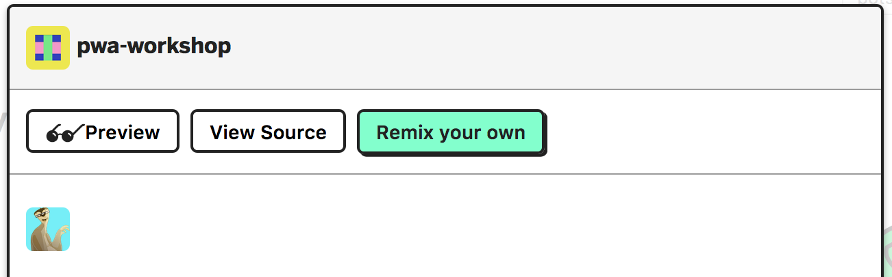

Glitch will generate a **new name** for the project and will open the code editor for it. Remember that the two projects, with the same code but with **different names** are, effectively, two different applications so even sharing the same content, they won't share memory or storage state.

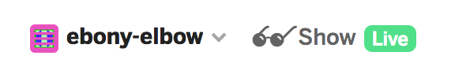

If you did not log in on Glitch, you will be able of modifying the project but you won't be able to save the changes if closing the tab. To save the changes from one session to another, log in with your [GitHub](https://github.com/login/oauth/authorize?client_id=b4cb743ed07e20abf0b2&scope=user:email&redirect_uri=https://glitch.com/login/github) or [Facebook](https://www.facebook.com/v2.9/dialog/oauth?client_id=660180164153542&scope=email&redirect_uri=https%3A%2F%2Fglitch.com%2Flogin%2Ffacebook) credentials.

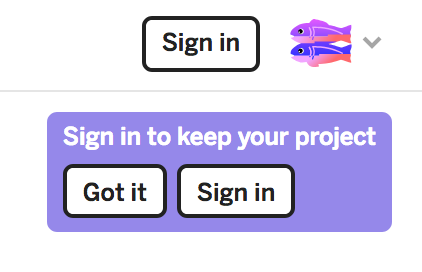

Once you have log in, you'll be able to manage the project settings using the project menu:

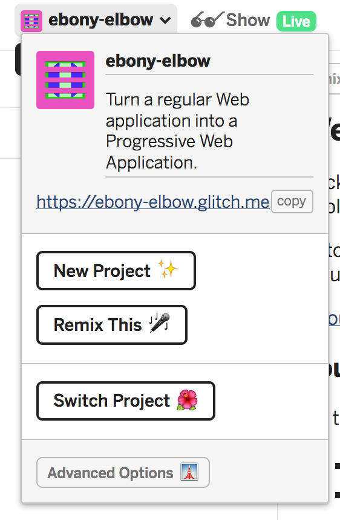

You can change the name clicking on it while the project menu is visible.

## Project live view {#show}

You can run the project by clicking on the "show" button:

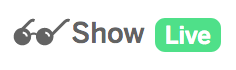

Glitch will open a new window and try to refresh it automatically upon any change on the client/server part of the project.

## Editing the project {#edit}

You can edit any of the files on the left of the editor:

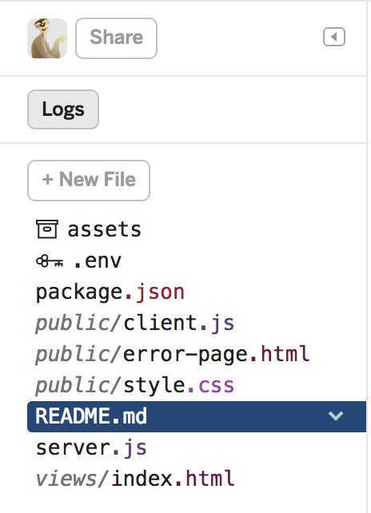

The `server.js` file is the entry point of the server. Any modification to this file will rerun the application.

You can also create new files with the "new file" button. The file must include the whole path to be place in. The the path does not exist, the proper folders would be created.

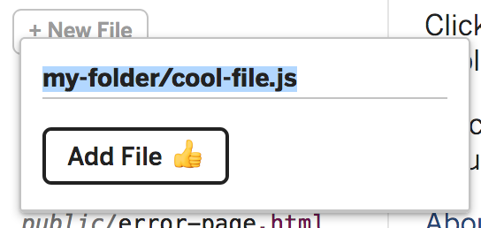

You won't find a "save" button because Glitch will try to save each modification as soon as it happens.

You can debug the server using logs. To show them, click on the "logs" button.

The `.env` file, preceded by the key icon is an especial private file with the environment variables. Only the project author can see and change it.

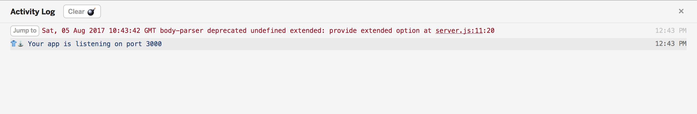

### Share the project code {#share}

To share the code, do click on the "share" button and use the first link to distribute your code in read-only mode or the second one to start a collaborative session.

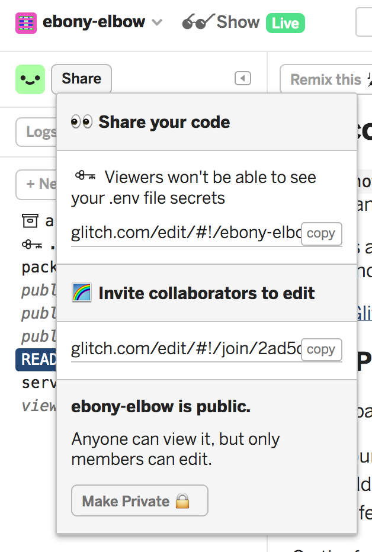

The content of the `.env` file can not be seen by the guests.

## Upload new assets {#assets}

With Glitch you can only create text files. Binary files such as images, video, audio... can be managed with the "assets" menu.

To visualize your porject resources, click on the "assets" item in the file list.

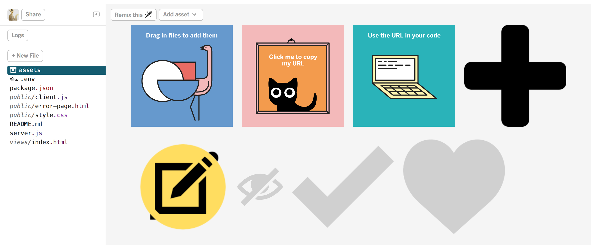

You can see the details of an asset by clicking on it. In this view you can find the resource URL. Copy it by clicking on "Copy Url".

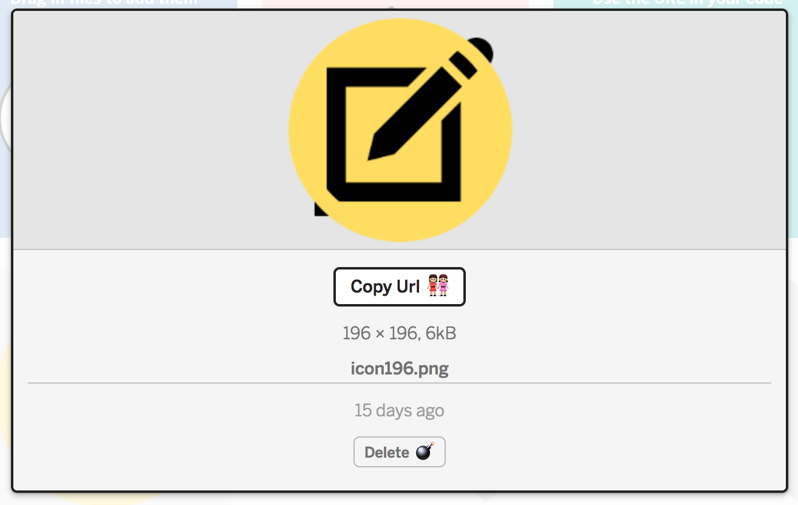

To add a new resource, click on "Add asset":

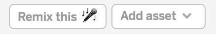
