## Introduction to the application {#intro}

_Recommendations_ is a web application to keep a list of recommendations. With _Recommendations_ we can mark a recommendation as reviewed or favourite.

---

_Recommendations_ is an old-style dynamic application: it has no client-JavaScript and relies solely on its [Node.js](https://nodejs.org/en/) web server powered by [Express](https://expressjs.com/). The server renders the list of recommendations using [handlebars](http://handlebarsjs.com/) templates.

For simplicity, the server does not manage sessions; neither it does persistence nor error handling so don't use it in production.

This requires you to [remix and get a personal copy of the project to work with](https://glitch.com/~pwa-workshop). The lack of persistence also implies that **all the changes in recommendations will be lost** if you modify the server file.

### Client code

To communicate with the server, the application uses `form` elements. The server then performs the requested operation, and always answer with the updated list of recommendations, using the `views/index.html` file as the template. In this sense, the application can be seen as a _single view application_ but it is not a _single page application_ since the moment we are actually navigating to other URLs.

The list has two kind of forms: one in the header to add a new recommendation and other in each recommendation to update its state.

The form to add a new recommendation has the fields to enter title and recommendation type. It also has the add button, to send the form. When adding a recommendation, the browser will perform a `POST` request on the `/recommendations` URL.

```html
<form class="new-recommendation" method="POST" action="/recommendations">
  <div class="offset title-area">
    <input id="title-input" name="title" type="text" required>
    <label for="title-input">Enter new recommendation&hellip;</label>
  </div>
  <div>
    <select name="type">
      <option value="movie">movie</option>
      <option value="show">show</option>
      <option value="music">music</option>
      <option value="game">game</option>
      <option value="reading">reading</option>
    </select>
    <button class="add-new" type="submit" aria-label="Add">&nbsp;</button>
  </div>
</form>
```

Each recommendation has another form, dynamically generated in the server, that will make a `POST` request on its _URL_, like `/recommendations/<id>`.

```html
<form method="POST" action="/recommendations/{{id}}">
  <div class="custom-checkbox">
    <input name="status" value="unchecked" {{#if unchecked}}checked{{/if}} type="radio" aria-label="I've not checked it yet" /><span></span>
  </div>
  <div class="custom-checkbox">
    <input name="status" value="checked" {{#if checked}}checked{{/if}} type="radio" aria-label="I've checked it" /><span></span>
  </div>
  <div class="custom-checkbox">
    <input name="status" value="liked" {{#if liked}}checked{{/if}} type="radio" aria-label="I liked it" /><span></span>
  </div>
  <input type="submit" class="update-item" aria-label="Save" value="OK!" />
</form>
```

### Server code

Like a regular Express application, the server is a set of operations on different routes providing an answer.

```js
app.get('/', renderList);
app.get('/recommendations', renderList);
app.get('/recommendations/:id', renderList);

app.post('/recommendations', function (request, response) {
  const { type, title } = request.body;
  recommendations.push(newRecommendation(type, title));
  renderList(request, response);
});

app.post('/recommendations/:id', function (request, response) {
  const unchecked = request.body.status === 'unchecked';
  const checked = request.body.status === 'checked';
  const liked = request.body.status === 'liked';
  const index = find(parseInt(request.params.id), recommendations);
  recommendations[index].unchecked = unchecked;
  recommendations[index].checked = checked;
  recommendations[index].liked = liked;
  renderList(request, response);
});
```

The first three `GET` operations govern the recommendation list visualization and they don't perform any operation. `POST` operations, in addition to answer with the list, will manage the recommendations.

The `renderList` function composes the list using `views/index.html` as the template.

```js
function renderList (request, response) {
  response.render(__dirname + '/views/index.html', {
    recommendations: sort(recommendations)
  });
}
```

## 1. Uso básico de service workers {#service-workers}

Un _service worker_ actúa como un proxy de red ejecutándose en el navegador: intercepta las peticiones HTTP que salen de nuestro sitio web hacia la red y puede contestar con cualquier tipo de contenido.

En esta primera lección, vamos a preparar nuestra aplicación para que funcione sin conexión a la red.

### Creación del fichero y registro {#registering}

Lo primero que vamos a hacer en Glitch es crear un nuevo archivo cuyo nombre será `public/service-worker.js`. En él escribiremos el código que controla la intercepción de las peticiones.

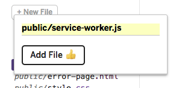

Visita tu aplicación haciendo click en `Show Live`, abre las herramientas de desarrollo y haz clic sobre la pestaña _Application_.

En la lista de la izquierda, haz clic en el elemento _Service Workers_ para comprobar que no hay ninguno asociado a ese origen.

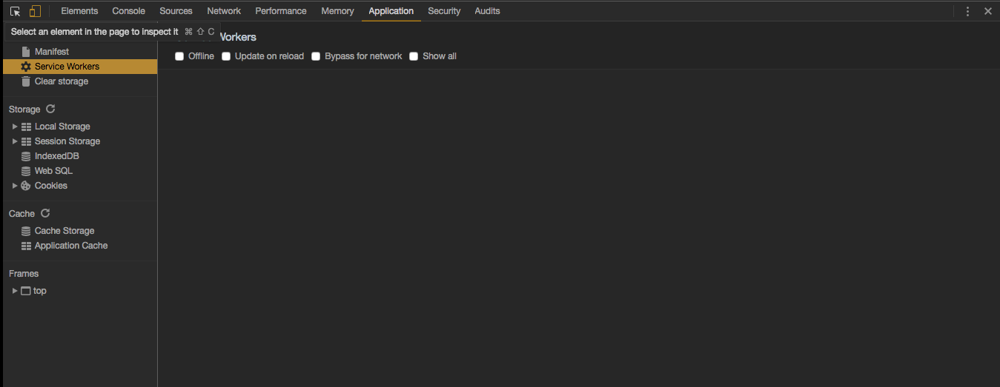

Recuerda que un origen no es lo mismo que un dominio. El origen es el protocolo junto con el nombre de dominio y el puerto. Así, `http://mozilla.org`, `https://mozilla.org` y `https://hacks.mozilla.org/` son orígenes distintos, como también lo son `localhost:8000` y `localhost:3333`.

Un service worker debe registrarse desde el hilo principal. Edita `public/client.js` y añade el siguiente código:

```js
if ('serviceWorker' in navigator) {
  navigator.serviceWorker.register('/service-worker.js')
  .then(function () { console.log('¡Service Worker registrado!'); })
  .catch(function (e) { console.error('Parece que hubo algún problema:', e)});
}
```

El condicional omite el proceso de registro si el navegador no soporta _service workers_. En caso de soportarlos, el método [`register`](https://developer.mozilla.org/en-US/docs/Web/API/ServiceWorkerContainer/register) devuelve una promesa que, en caso de cumplirse, garantiza que el _service worker_ pudo descargarse, interpretarse correctamente y se encuentra en proceso de instalación.

Por supuesto, has de incluir el script en el punto de entrada HTML. En este caso edita `views/index.html` y antes de la etiqueta de cierre de la cabecera `</head>`, añade la siguiente línea:

```html
<script src="/client.js"></script>
```

Cuando tu aplicación se actualice, comprueba que en la consola aparece el mensaje de que todo ha ido bien y que en la sección _Service workers_ de la pestaña _Application_ se muestra el _service worker_ como aparece en la captura siguiente:

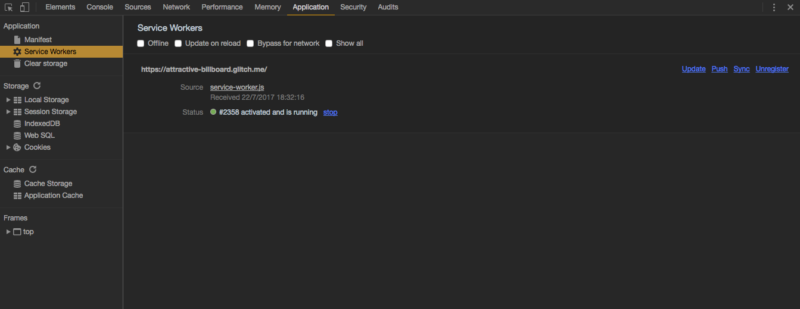

Un _service worker_ sólo puede registrarse desde un origen seguro, que utilice [HTTPS](https://es.wikipedia.org/wiki/Hypertext_Transfer_Protocol_Secure). Puedes comprobar otros requerimientos rápidamente en la infografía [_Service Workers 101_](https://github.com/delapuente/service-workers-101#service-workers-101).

### Instalación y activación del _service worker_ {#installation}

Vamos a modificar el _service worker_ &mdash;de ahora en adelante _SW_&mdash; múltiples veces y cada vez que lo hagamos, Glitch relanzará nuestra aplicación. Es conveniente, por tanto, activar la opción _Update on reload_ del menú _Service Workers_ del panel _Application_ para garantizar que el _SW_ se actualiza en cada recarga.

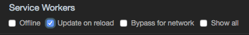

El panel de aplicación debería indicar que nuestro _SW_ funciona correctamente aunque todavía no haga nada. Durante la instalación, el _SW_ pasa por tres estados (que puedes revisar en la inforgrafía [_Service Workers 101_](https://github.com/delapuente/service-workers-101#service-workers-101)):

  1. Instalando: pensado para preparar la infraestructura necesaria para el funcionamiento del _SW_.
  2. Activando: pensado para retirar la infraestructura de alguna versión anterior del _SW_.
  3. Activo: listo para interceptar peticiones a la red.

Añade el siguiente código al fichero del _service worker_ `public/service-worker.js`:

```js
var VERSION = 1;
var PREFIX = '__pwa-workshop';
var CACHE_NAME = `${PREFIX}-assets-v${VERSION}`;
var ASSETS = [
  'https://cdn.glitch.com/aa6a5f34-4aee-4eae-807f-ca86f623e58a%2Finvisible.svg?1500732711924',
  'https://cdn.glitch.com/aa6a5f34-4aee-4eae-807f-ca86f623e58a%2Ftick-sign.svg?1500732712044',
  'https://cdn.glitch.com/aa6a5f34-4aee-4eae-807f-ca86f623e58a%2Flike.svg?1500732712234',
  'https://cdn.glitch.com/aa6a5f34-4aee-4eae-807f-ca86f623e58a%2Flike-black.svg?1500733444163',
  'https://cdn.glitch.com/aa6a5f34-4aee-4eae-807f-ca86f623e58a%2Finvisible-black.svg?1500733601054',
  'https://cdn.glitch.com/aa6a5f34-4aee-4eae-807f-ca86f623e58a%2Ftick-sign-black.svg?1500733601379',
  'https://cdn.glitch.com/aa6a5f34-4aee-4eae-807f-ca86f623e58a%2Ficon196.png?1500664388904',
  'https://cdn.glitch.com/aa6a5f34-4aee-4eae-807f-ca86f623e58a%2Fplus-black-symbol.svg?1499350618348',
  'https://fonts.googleapis.com/css?family=Poppins',
  'https://fonts.gstatic.com/s/poppins/v2/HUuNgGR31mqIHE6zs0BlBgLUuEpTyoUstqEm5AMlJo4.woff2',
  '/client.js',
  '/style.css',
  '/error-page.html',
  '/recommendations/', // For the cache, these URLs are different. You need both
  '/recommendations',  // to manage them automatically.
  '/'
];

self.addEventListener('install', event => {
  event.waitUntil(Promise.all([addAssets(), self.skipWaiting()]));
});

self.addEventListener('activate', event => {
  event.waitUntil(Promise.all([clearOldCaches(), self.clients.claim()]));
});
```

En el contexto de un _service worker_ o de cualquier otro _worker_, `self` hace referencia siempre al objeto global. Con `addEventListener` podemos suscribirnos a los cambios en el ciclo de vida del _SW_.

El método [`waitUntil`](https://developer.mozilla.org/en-US/docs/Web/API/ExtendableEvent/waitUntil) de los eventos `install` y `activate` permite extender las fases de instalación y activación respectivamente, hasta que la promesa pasada como parámetro se resuelva.

Entre la instalación y la activación, el navegador espera a que todos los clientes actualmente controlados por un _service worker_ se cierren, antes de activar el siguiente. Con el método [`skipWaiting`](https://developer.mozilla.org/en-US/docs/Web/API/ServiceWorkerGlobalScope/skipWaiting) podemos acelerar el proceso evitando la espera del _SW_.

Durante la activación, utilizamos el método [`claim`](https://developer.mozilla.org/en-US/docs/Web/API/Clients/claim) para hacer que el _SW_ intercepte todas las peticiones originadas en los clientes activos (pestañas ya abiertas, otros _workers_&hellip;) a partir de ahora.

Aun no hemos escrito las funciones `addAssets` y `clearOldCaches`, por lo que el proceso de instalación falla en tiempo de ejecución y **la instalación se interrumpe**. Podéis ver los errores relacionados con la instalación del _SW_ bajo el estado, en la vista _Service Workers_, en la pestaña _Application_.

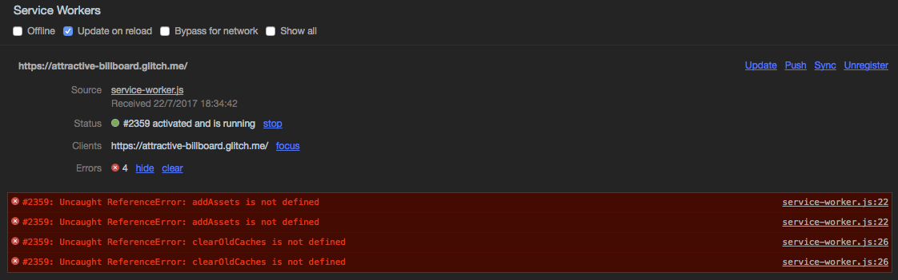

Antes de continuar, **borra los errores** y luego añade el siguiente listado con la implementación de las funciones que faltan:

```js
function addAssets() {
  return self.caches.open(CACHE_NAME)
  .then(cache => cache.addAll(ASSETS));
}

function clearOldCaches() {
  return self.caches.keys()
  .then(allCaches => {
    return allCaches.filter(cacheName => {
      var isMine = cacheName.indexOf(PREFIX) === 0;
      var isNotTheNewest = cacheName !== CACHE_NAME;
      return isMine && isNotTheNewest;
    });
  })
  .then(oldCaches => {
    return oldCaches.map(cacheName => {
      return self.caches.delete(cacheName);
    });
  })
  .then(deletingTasks => Promise.all(deletingTasks));
}
```

Ls función `addAssets` acepta una lista de recursos (_assets_), y con el método [`open`](https://developer.mozilla.org/en-US/docs/Web/API/CacheStorage/open), abre una nueva caché (creándola si no existía) donde añadir estos recursos. Para ello utiliza el método [`addAll`](https://developer.mozilla.org/en-US/docs/Web/API/Cache/addAll) de la caché.

La lista de recursos `ASSETS` contiene los iconos de la aplicación, la hoja de estilos, el código JavaScript del cliente (exceptuando el _SW_), las fuentes, la página de error y el índice.

La función `clearOldCaches` obtiene, con el método [`keys`](https://developer.mozilla.org/en-US/docs/Web/API/CacheStorage/keys), todos los nombres de las caches en el origen, reconoce las propias y borra las antiguas con el método [`delete`](https://developer.mozilla.org/en-US/docs/Web/API/Cache/delete).

Si todo ha ido bien, no deberías ver nuevos errores bajo el estado del _service worker_. Si además haces click en el elemento _Cache storage_, deberías poder ver un listado de las caches y su contenido (haz click en el icono de refrescar si no aparece nada). Prueba a cambiar el número de versión para comprobar que el código funciona correctamente.

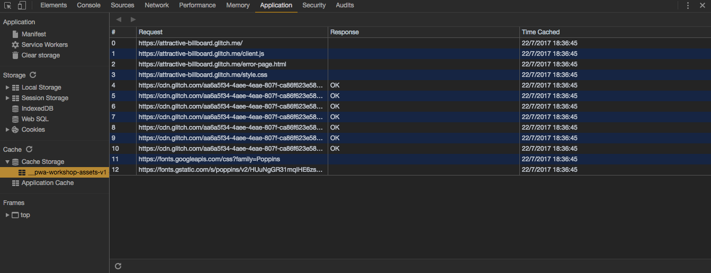

### Estrategias de caché {#cache-strategies}

Gracias a las cachés sin conexión ([_Offline Caches_](https://developer.mozilla.org/en-US/docs/Web/API/Cache)) hemos guardado los recursos necesarios para recrear la interfaz de usuario sin necesidad de estar conectados a la red; pero aun no le hemos dicho al _SW_ cuándo debe servir estos recursos. Por el momento, todas las peticiones alcanzan la red.

Puedes ir al panel _Network_ en las herramientas de desarrollador y activar el interruptor _Offline_ para simular que no hay red. Realiza alguna acción o recarga y verás como la aplicación falla estrepitosamente.

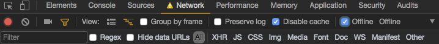

Sin modificar una sola línea en el código de la _UI_, nuestra intención es crear una capa de red, en el _service worker_, que responda de forma diferente según el tipo de petición y el estado de la conexión.

Empieza añadiendo el siguiente listado, tras registrar el _listener_ del evento `activate`:

```js
self.addEventListener('fetch', event => {
  var result = handleRequest(event.request);
  var response = result[0];
  var completion = result[1];
  event.respondWith(response);
  event.waitUntil(completion);
});
```

La función `handleRequest` será la encargada de implementar esta capa de red y devolverá una lista con dos promesas. El método [`respondWith`](https://developer.mozilla.org/en-US/docs/Web/API/FetchEvent/respondWith) consumirá la primera, que debe resolverse con un objeto del tipo [`Response`](https://developer.mozilla.org/en-US/docs/Web/API/Response) y será entregado al navegador para que sirva de respuesta a la petición. De nuevo, utilizaremos [`waitUntil`](https://developer.mozilla.org/en-US/docs/Web/API/ExtendableEvent/waitUntil) para extender la vida del _SW_ hasta que la segunda promesa de la lista se resuelva.

Los _service workers_ están pensados para realizar una tarea concreta y cerrarse de forma que no consuman recursos innecesarios. Dada su naturaleza asíncrona, no se puede determinar de antemano cuándo un _service worker_ ha terminado. Es por ello que utilizamos `waitUntil` con una promesa. Tal promesa expresa que **todas las acciones que queremos realizar han terminado**.

Por el mismo motivo, no se puede confiar en el estado global de un _service worker_ _como mecanismo de persistencia_ dado que, tarde o temprano, el navegador lo eliminará y el estado global se perderá. Esto no significa que no podamos confiar en el estado global _para compartir valores comunes e inmutables_ (como el listado de `ASSETTS`).

#### Estrategia _sólo caché_

Antes de continuar, comprueba que has desactivado el modo _Offline_ y refresca la pestaña.

Comencemos de forma sencilla. Añade el siguiente listado al final del fichero del _SW_:

```js
function handleRequest(request) {
  if (isAsset(request)) {
    return only(fromCache(request));
  }
  return only(fetch(request));
}

function isAsset(request) {
  var url = new URL(request.url);
  return request.method === 'GET' &&
         !isIndex(request) &&
         (ASSETS.indexOf(url.href) >= 0 ||
         ASSETS.indexOf(url.pathname) >= 0);
}

function isIndex(request) {
  var url = new URL(request.url);
  return url.pathname === '/';
}

function fromCache(request) {
  return self.caches.open(CACHE_NAME)
  .then(cache => cache.match(request));
}

function only(promise) {
  return [promise, Promise.resolve()];
}
```

Ve ahora a la pestaña _Network_ y limpia los logs. Recarga la pestaña manualmente y observa los resultados en la lista de peticiones. Verás como los recursos se sirven desde el _SW_:

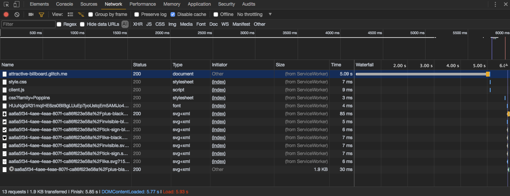

Date cuenta de que aunque se indique que el recurso se ha servido desde el _SW_, esto **no significa que se haya servido desde una caché**.

Si activas el modo _Offline_ y recargas, verás cómo la aplicación sigue fallando. Esto es porque el índice no se considera un recurso (_asset_) en la función `isAsset` y, por tanto, no se sirve desde la caché.

Sin embargo, podrías consultar la página de error `/error-page.html` dado que esta sí se considera un recurso y se servirá desde la caché. Lo mismo ocurre con cualquier recurso que incluyeras en la variable `ASSETS`.

El código anterior se explica por sí mismo: si la petición es un recurso, lo servimos desde la caché con la función `fromCache`. Si no, lo servimos desde la red con [`fetch`](https://developer.mozilla.org/en-US/docs/Web/API/WindowOrWorkerGlobalScope/fetch). La nueva [_API fetch_](https://developer.mozilla.org/en/docs/Web/API/Fetch_API) tiende a reemplazar a la famosa interfaz [`XMLHttpRequest`](https://developer.mozilla.org/en-US/docs/Web/API/XMLHttpRequest) y además, es la única forma de realizar una petición desde un _SW_. Ninguna de las peticiones originadas en un _SW_ será jamás interceptada.

La función `fromCache` usa el método [`match`](https://developer.mozilla.org/en-US/docs/Web/API/Cache/match) de las cachés para buscar una respuesta a la petición pasada como parámetro.

La función `only` es una función auxiliar que produce una lista cuyo segundo elemento es una promesa resuelta. Se espera que se use dentro de la función `handleRequest` para indicar que no se necesita esperar por nada al atender el evento `fetch`.

Desactiva el modo _Offline_ y vuelve al índice (`/`) antes de continuar.

#### Estrategia _red más actualización o alternativa sin conexión_

Veamos ahora cómo tratar las acciones. Modifica la función `handleRequest` para que quede de la siguiente forma:

```js
function handleRequest(request) {
  if (isAsset(request)) {
    return only(fromCache(request));
  }
  if (isIndex(request) || isAction(request)) {
    var offlinePage = isIndex(request) ? cachedIndex() : errorPage();
    return fetchAndUpdateIndex(request, offlinePage);  
  }
  return only(fetch(request));
}
```

En palabras:

  1. Si la petición es un recurso, sabemos que está en caché luego lo servimos desde la caché.
  2. Si la petición es el índice o una operación sobre la _API_, queremos que llegue a la red. De no haber red, queremos poder dar una alternativa sin conexión. Esta alternativa dependerá de si estamos visitando el índice o realizando una operación sobre la _API_. En el primer caso devolveremos la lista más actualizada desde la caché. En el segundo mostraremos una pantalla de error, dando la opción de volver al índice.
  3. En cualquier otro caso, dejaremos que la petición alcance la red normalmente.

Añade el siguiente listado al final del archivo:

```js
function isAction(request) {
  var url = new URL(request.url);
  return request.method === 'POST' &&
         url.pathname.indexOf('/recommendations') === 0;
}

function cachedIndex() {
  return fromCache('/');
}

function errorPage() {
  return fromCache('/error-page.html');
}

function fetchAndUpdateIndex(request, offlineAlternative) {
  var done;
  var completion = new Promise(resolve => done = resolve);
  var response = doRequest(request, offlineAlternative, done);
  return [response, completion];

  function doRequest(request, offlineAlternative, done) {
    return fetch(request)
    .then(response => {
      if (!response.ok) {
        done();
        return offlineAlternative;
      }
      updateIndex(response.clone()).then(done);
      return response;
    })
    .catch(reason => {
      done();
      return offlineAlternative;
    });
  }
}

function updateIndex(response) {
  return self.caches.open(CACHE_NAME)
  .then(cache => cache.put('/', response));
}
```

La función `fetchAndUpdateIndex`, en particular, la función auxiliar interna `doRequest`, implementa buena parte de la lógica de caché. Respondemos con la alternativa sin conexión cuando `fetch` falla o el servidor devuelve una respuesta _no OK_, lo que quiere decir que no está en el rango [`2XX`](https://en.wikipedia.org/wiki/List_of_HTTP_status_codes#2xx_Success). Si todo ha salido bien, `updateIndex` actualiza el índice (la lista de recomendaciones) con una copia de la petición, utilizando el método [`put`](https://developer.mozilla.org/en-US/docs/Web/API/Cache/put)) de las cachés. La respuesta original se usa para responder al cliente.

El cuerpo de una respuesta **sólo puede utilizarse una vez**, o se utiliza para representarse en el cliente o se utiliza para guardarse en la caché. Es por ello que copiamos la respuesta con [`clone`](https://developer.mozilla.org/en-US/docs/Web/API/Response/clone) antes de actualizar la caché.

**Recarga la aplicación** y con estos cambios ya puedes pasar a modo _Offline_ y probar a visitar el índice y a realizar alguna operación para alcanzar la página informativa.

### Conclusión {#service-workers-conclusion}

Antes de terminar la lección, comprueba:

  * Que habiendo activado el interruptor _Offline_, puedes seguir accediendo al índice.
  * Que realizar cualquier acción se traduce en la pantalla de error.
  * Que puedes volver al índice desde la pantalla de error.
  * Que no falta ninguna imagen.
  * Si te sientes valiente, desconecta internet, cierra el navegador y prueba a entrar otra vez en el índice.

Los _service workers_ son una potentísima herramienta que permite la implementación de multitud de casos de uso. Su principal cometido es el de facilitar la [implementación de distintas estrategias de caché](https://jakearchibald.com/2014/offline-cookbook/) pero, por su naturaleza como proxy de red, también habilita [otros usos más allá de los convencionales](https://hacks.mozilla.org/2015/12/beyond-offline/).

Si quieres explorar estos y otros usos de los _service workers_, te recomiendo que visites el [Service Worker Cookbook](https://serviceworke.rs).

## 2. El manifiesto web {#web-manifest}

**Nota**: si no pudiste completar el paso anterior, ¡no te bloquees! [Remezcla el proyecto una vez añadido el service worker](https://glitch.com/~pwa-workshop-step2) y continúa en casa con el anterior.

---

Antes de comenzar la lección, asegúrate de que el modo _Offline_ está desactivado.

El manifiesto web es un fichero _JSON_ que contiene un objeto con [claves bien conocidas](https://w3c.github.io/manifest/#manifest-and-its-members), y que se enlaza desde nuestra página web de manera que el navegador obtenga la información al cargar la cabecera de la página.

La información del manifiesto puede utilizarse para mejorar la integración del sitio web con el navegador o con el sistema operativo, aunque también puede ser utilizado por los buscadores web para mejorar la clasificación de estas páginas web.

Crea un nuevo fichero en Glitch llamado `public/manifest.json` y añade el siguiente contenido:

```js
{
  "name": "Recommendations",
  "short_name": "Recommendations",
  "description": "Keep track of everything you're recommended",
  "theme_color": "#FFDD60",
  "background_color": "#FFDD60",
  "display": "standalone",
  "icons": [
    {
      "src": "https://cdn.glitch.com/aa6a5f34-4aee-4eae-807f-ca86f623e58a%2Ficon196.png?1500664388904",
      "sizes": "196x196",
      "type": "image/png"
    }
  ]
}
```

Antes de profundizar en cada clave, enlaza el manifiesto con tu página web añadiendo el siguiente elemento HTML antes del cierre de la etiqueta `head`:

```html
<link rel="manifest" href="/manifest.json">
```

Las claves `name`, `short_name` y `description` son autoexplicativas. La clave `short_name` se prefiere cuando el espacio en pantalla para mostrar el nombre es limitado. Por ejemplo, en el caso del nombre bajo el icono en la pantalla de inicio.

Los campos `theme_color` y `background_color` colorean la interfaz de usuario del navegador. En particular, `background_color` se refiere al color de fondo del navegador mientras se carga la página web.

El campo `display` permite seleccionar una experiencia de navegación óptima, siendo `standalone` el valor que corresponde a la ausencia total de elementos de navegación.

La lista `icons` contiene una lista de iconos con entradas para las distintas resoluciones de pantalla y densidades de píxeles.

Para una descripción completa y con ejemplos de los campos del manifiesto, puedes consultar [la página sobre el manifiesto web de la MDN](https://developer.mozilla.org/en-US/docs/Web/Manifest#Members).

Las herramientas de desarrollador de Chrome incluyen, en la pestaña _Application_ y sección _Manifest_, una visualización de los distintos campos del mismo.

### Conclusión {#web-manifest-conclusion}

Visita tu aplicación desde el móvil usando Chrome, navegador que pone especial énfasis en la integración con el manifiesto, y añade tu aplicación a la pantalla de inicio:


  * Observa la _splashpage_ que genera Chrome gracias al color de fondo y la lista de iconos.
  * Fíjate en la ausencia de interfaz de usuario relacionada con el navegador.
  * Y observa como la aplicación tiene su propio lugar en el cambiador de tareas.

Con estas modificaciones, tu sitio web ya entra en las definiciones de _progressive web apps_ más extendidas. No obstante recuerda que las [_PWA_ no son una receta sino una herramienta](https://medium.com/samsung-internet-dev/progressive-web-apps-are-a-toolkit-not-a-recipe-b2fd68613de5).


## 3. Uso básico de notificaciones _push_ {#push-notifications}

**Nota**: si no pudiste completar el paso anterior, ¡no te preocupes! [Remezcla el proyecto una vez añadido el manifiesto web](https://glitch.com/~pwa-workshop-step3) y continúa cuando puedas con el anterior.

---

Las notificaciones _push_ tienen una interpretación doble: desde el punto de vista de red, una notificación _push_ es una comunicación desde el servidor al cliente, iniciada por el servidor sin que el cliente haya realizado una petición previa.

Por otro lado, desde el punto de vista de la experiencia de usuario, una notificación _push_ es un elemento de interfaz cuya finalidad es interrumpir levemente la actividad del usuario para comunicar cierta información.

Lo común es encontrar una tercera definición que reúne estas dos y establece que cualquier comunicación iniciada en el servidor debe manifestarse ante el usuario. De hecho, los navegadores actuales fuerzan esta dependencia de forma que si no se muestra una notificación al usuario como respuesta a una notificación _push_ proveniente del servidor, el navegador muestra una genérica.

No obstante, algunos navegadores están experimentando con permitir algunas notificaciones silenciosas, que no interrumpan la acción del usuario.

Por esto y por precisión, conviene conocer la diferencia entre el protocolo de red y la metáfora visual.

### Estableciendo la comunicación cliente-servidor {#client-server}

**Nota**: configurar las notificaciones _push_ para que funcionen con Chrome, Samsung Internet y Opera requiere conocer los valores `gcm_sender_id` y `gcm_api_key` de una aplicación [Firebase](https://firebase.google.com/). Aunque se te propocionarán unos valores de prueba durante el taller, puedes crear tu propia aplicación Firebase y consultar esta [guía de TapJoy para saber dónde encontrarlos](http://dev.tapjoy.com/faq/how-to-find-sender-id-and-api-key-for-gcm/).

---

**Nota**: vamos a modificar el el código del fichero `public/client.js`. Este fichero es un recurso y, por tanto, se encuentra cacheado. Para que el código se actualice, tenemos que hacer que el _service worker_ realice una nueva descarga del recurso durante la instalación. Antes de editarlo, asegúrate de tener el interruptor _Update on reload_ (en la sección _Service Workers_ de la pestaña _Application_) activado.

También puedes borrar todos los datos asociados a la aplicación, en la sección _Clear storate_ de la pestaña _Application_.

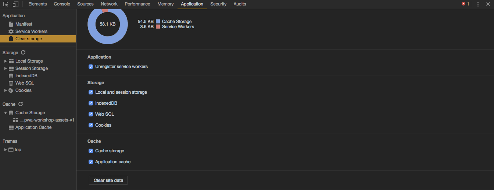

---

Comenzar a enviar notificaciones, sin el permiso explícito del usuario, podría llegar a ser molesto para el usuario. Por ello, los navegadores prefieren que el usuario otorgue permiso explícito para recibir notificaciones. En el código de cliente, esto se traduce a pedir una subscripción.

Edita el fichero `public/manifest.json` y añade la clave `gcm_sender_id` con el valor que te proporcionarán en el taller o el que obtengas de tu aplicación Firebase.

Ahora abre el fichero `public/client.js` y modifícalo para que quede así:

```js
if ('serviceWorker' in navigator) {
  navigator.serviceWorker.register('/service-worker.js')
  .then(function (registration) { console.log('¡Service Worker registrado!'); })
  .catch(function (e) { console.error('Parece que hubo algún problema:', e)});

  navigator.serviceWorker.ready.then(function (registration) {
    if ('pushManager' in registration) {
      return subscribeToNotifications(registration.pushManager);
    }
  });
}

function subscribeToNotifications(pushManager) {
  return pushManager.getSubscription()
  .then(function (subscription) {
    if (subscription) {
      return subscription;
    }
    return pushManager.subscribe({ userVisibleOnly: true });
  })
  .then(sendDetailsToTheServer);
}

function sendDetailsToTheServer(subscription) {
  return fetch('/subscribe', {
    method: 'POST',
    headers: {
      'Content-Type': 'application/json'
    },
    body: JSON.stringify({
      endpoint: subscription.endpoint,
      key: toBase64(subscription.getKey('p256dh')),
      auth: toBase64(subscription.getKey('auth'))
    })
  });
}

function toBase64(target) {
  return !target ? '' :
         btoa(String.fromCharCode.apply(null, new Uint8Array(target)));
}
```

Lo que estamos haciendo con este listado es pedir al **servicio de notificaciones del navegador** que nos proporcione una subscripción. Es decir, un canal seguro por el que transmitir información hacia el cliente.

Primero comprobamos que no exista una subscripción anterior con el método [`getSubscription`](https://developer.mozilla.org/en-US/docs/Web/API/PushManager/getSubscription) de la interfaz [`PushManager`](https://developer.mozilla.org/en-US/docs/Web/API/PushManager). si existe, reciclaremos esta pero si no, pediremos una subscripción con el método [`subscribe`](https://developer.mozilla.org/en-US/docs/Web/API/PushManager/subscribe).

El parámetro `userVisibleOnly` garantiza al navegador que siempre mostraremos una notificación al usuario. Esta es una restricción impuesta por el navegador Chrome.

En el momento que llamamos a `subscribe`, el navegador comprueba los permisos otorgados por el usuario y pregunta en caso de que no exista el permiso para ese dominio.

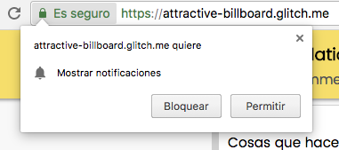

Si el usuario deniega el permiso, no podremos volver a mostrar el diálogo. Por esto, conviene planificar el momento en el que pedimos el permiso y presentar la característica al usuario haciendo, por ejemplo, que la llamada a `subscribe` se produzca como consecuencia de una acción del usuario. Siempre será mejor preguntarle dos veces que perder la oportunidad de preguntarle para siempre.

Si trabajáramos en un sitio web real, quizá debiéramos pedir permiso cuando sepamos algo más sobre el usuario: cuando detectemos que no ha marcado ninguna recomendación durante semanas o, si se tratara de un blog, al detectar que el usuario termina de leer un artículo, o al finalizar una compra con éxito, si se tratase de un sitio de comercio _online_.

La subscripción incluye una _URL_ o _endpoint_ al que realizaremos las peticiones de envío de las notificaciones y unas claves necesarias para cifrar el contenido de las mismas.

Fíjate en que la interfaz JavaScript que devuelve la subscripción sólo se comunica con el navegador y es necesario que el cliente comunique a su servidor los detalles de la subscripción, que es lo que se hace en la función `sendDetailsToTheServer`. Para ello utilizamos la función  [`fetch`](https://developer.mozilla.org/en-US/docs/Web/API/WindowOrWorkerGlobalScope/fetch) de la que ya habíamos hablado anteriormente.

Pese a que aceptemos el permiso, la subscripción no funcionará. Si consultas la consola verás que el servidor responde con un error `404` puesto que la _API_ para realizar la subscripción aún no existe y no podemos comunicar los detalles de la subscripción a nuestro servidor:

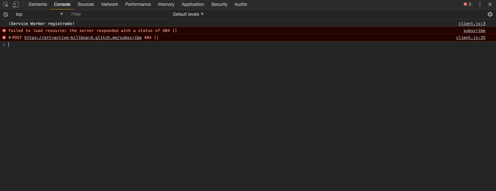

Edita ahora el fichero del servidor `server.js` para que guarde los detalles de la subscripción. Añade la siguiente ruta justo antes de la declaración de `recommendations`:

```js
app.post('/subscribe', function (request, response) {
  subscriptions[request.body.endpoint] = {
    key: request.body.key,
    auth: request.body.auth
  };
  response.sendStatus(201);
});

var subscriptions = {};
```

En la pestaña _Network_, puedes comprobar el resultado de la petición `POST` al servidor:

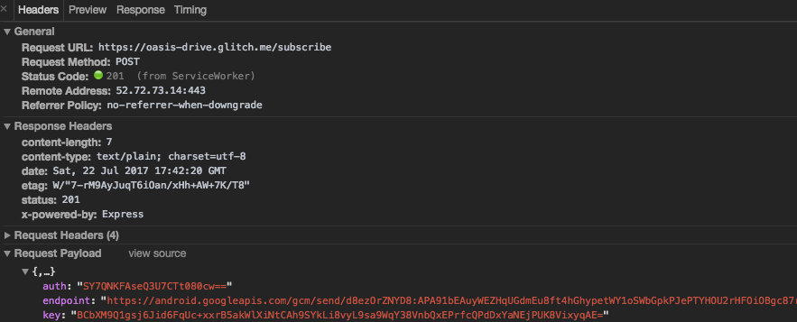

### Enviando notificaciones a los clientes {#sending-notifications}

¿Recuerdas la definición de notificación _push_? En este punto vamos a implementar la primera interpretación. Es decir, la comunicación que ocurre desde el servidor hacia el cliente.

Para ello modifica el código del archivo `server.js` para que haga uso de la biblioteca `WebPush` que abstrae los detalles acerca de cómo enviar notificaciones a través de una interfaz más amable. Comienza solicitando la biblioteca añadiendo la siguiente línea al comienzo del archivo:

```js
var webPush = require('web-push');
webPush.setGCMAPIKey('XXXXXXXXX'); // Reemplaza esta valor por el que te
                                   // proporcionen en el taller o por el que
                                   // obtengas de tu aplicación Firebase.
```

Ahora modifica la declaración de `listener` para llamar al planificador de notificaciones:

```js
var listener = app.listen(process.env.PORT, function () {
  console.log('Your app is listening on port ' + listener.address().port);
  scheduleNotification();
});

var NOTIFICATION_PERIOD = 60 * 1000; // 1 min

function scheduleNotification() {
  setTimeout(function () {
    const total = getUncheckedRecommendations();
    if (total > 0) {
      const summary = getSummary(total);
      Object.keys(subscriptions).forEach(sendNotification.bind(undefined, summary));
    }
    scheduleNotification();
  }, NOTIFICATION_PERIOD);
}

function getUncheckedRecommendations() {
  return recommendations.reduce(function (total, recommendation) {
    return recommendation.unchecked ? total + 1 : total;
  }, 0);
}

function getSummary(total) {
  return `You still have ${total} unchecked recommendation${total > 1 ? 's' : ''}`;
}

function sendNotification(summary, endpoint) {
  const subscription = {
    endpoint,
    keys: {
      auth: subscriptions[endpoint].auth,
      p256dh: subscriptions[endpoint].key
    },
    ttl: 60 * 60
  };
  webPush.sendNotification(subscription, summary);
}
```

Las funciones `getUncheckedRecommendations` y `getSummary` no tienen misterio. La primera cuenta el número de recomendaciones que aun no hemos comprobado y la segunda compone un mensaje con este número.

La función `sendNotification` utiliza la biblioteca `webPush` para enviar una notificación mediante el método [`sendNotification`](https://github.com/web-push-libs/web-push#sendnotificationpushsubscription-payload-options).

La constante `NOTIFICATION_PERIOD` establece cada cuánto se lanzará una nueva notificación. Cuando hayamos comprobado que todo funciona podemos elevar este número a 48 horas o el tiempo que consideremos oportuno.

Recuerda que, cuando modificas el servidor, Glitch relanza la aplicación y todas las subscripciones se pierden. Es necesario **recargar el cliente para que este envíe una nueva subscripción al servidor**.

No te esfuerces. No vas a ver nada en este momento. Sigue leyendo para saber por qué.

### Mostrando la notificación al usuario {#showing-notifications}

Es difícil comprobar que, efectivamente, la notificación ha alcanzado al cliente porque este no la trata: no hay aún una asociación entre recibir una notificación desde el servidor y usar la interfaz de usuario para mostrarla.

Esto lo arreglaremos en el _service worker_. Lo que haremos será añadir un manejador para el evento [`push`](https://developer.mozilla.org/en-US/docs/Web/Events/push). Modifica el fichero del _SW_ `public/service-worker.js` y añade esto al final del mismo:

```js
self.addEventListener('push', event => {
  var payload = event.data.text();
  event.waitUntil(self.registration.showNotification('Recommendations', {
    body: payload
  }));
});
```

El método [`showNotification`](https://developer.mozilla.org/en-US/docs/Web/API/ServiceWorkerRegistration/showNotification) mostrará la interfaz de usuario del sistema operativo asociada a una notificación. Como cuerpo de la notificación, utilizaremos el contenido de la notificación _push_ que está disponible a través de la propiedad [`data`](https://developer.mozilla.org/en-US/docs/Web/API/PushMessageData) del evento.

Recuerda recargar el cliente para que envíe la información de su suscripción. Al cabo de 1 minuto deberías poder ver la notificación:

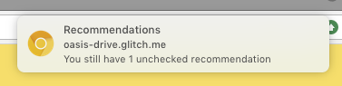

### Acción al pulsar en la notificación {#notification-action}

Las notificaciones pueden recibirse sin tener la pestaña abierta e incluso, sin tener el navegador abierto. Por ello, al hacer click sobre la notificación sería conveniente recuperar la pestaña con la aplicación o, en su defecto, abrir una pestaña nueva.

El evento [`notificationclick`](https://developer.mozilla.org/en-US/docs/Web/Events/notificationclick) nos permite responder a la pulsación sobre una notificación. Añade el siguiente listado al final del _SW_:

```js
self.addEventListener('notificationclick', event => {
  event.waitUntil(focusOnOpenTabOrNew());
});

function focusOnOpenTabOrNew() {
  return self.clients.matchAll({ type: 'window' })
  .then(clientList => {
    if (clientList.length > 0) {
      return clientList[0].focus();
    }
    return self.clients.openWindow('/');
  });
}
```

Como en otras ocasiones, utilizamos `waitUntil` para mantener el _SW_ corriendo hasta que todas las operaciones asíncronas hayan terminado. Esta vez, utilizamos el método [`matchAll`](https://developer.mozilla.org/en-US/docs/Web/API/Clients/matchAll) para recuperar un listado completo de todas las ventanas/pestañas controladas por el _SW_ (de ahí el parámetro `type`). Si no hay ninguna, abriremos una utilizando [`openWindow`](https://developer.mozilla.org/en-US/docs/Web/API/Clients/openWindow). Si existe alguna, bastará con darle el foco de atención mediante su método [`focus`](https://developer.mozilla.org/en-US/docs/Web/API/Window/focus).

### Conclusión {#push-notifications-conclusion}

Has llegado al final del taller de aplicaciones progresivas. Antes de finalizar, comprueba:

  1. Que recibes las notificaciones periódicamente.
  2. Que si marcas como vistas todas tus recomendaciones, no recibes notificación.
  3. Que recibes las notificaciones desde el móvil (incluso cuando el navegador no está abierto).
  4. Que si cierras todas las pestañas, se abre una nueva al pulsar sobre la notificación.
  5. Que si ya hay una pestaña abierta, esta recupera el foco tras pulsar sobre la notificación.

Recuerda que puedes encontrar otras formas de utilizar las notificaciones _push_ en la [sección de notificaciones _push_ del Service Worker Cookbook](https://serviceworke.rs/web-push.html). Las notificaciones _push_ pueden convertirse en una herramienta de captación y conversión de clientes extraordinaria, pero también pueden llegar a resultar frustrantes para el usuario. Por ello, piensa:

  1. Cuándo pedir permiso. Recuerda que sólo tienes una oportunidad de que el usuario te otorgue el permiso para notificar. Echa un vistazo a algunos [patrones de experiencia de usuario para pedir permiso]((https://developers.google.com/web/fundamentals/engage-and-retain/push-notifications/permission-ux)).
  2. Cuándo mostrar las notificaciones. Para que las notificaciones no resulten frustrantes, estas deben ser [oportunas, relevantes y precisas](https://developers.google.com/web/fundamentals/engage-and-retain/push-notifications/).

---

¡Enhorabuena! Has completado tu primera _PWA_ partiendo de una aplicación web sin JavaScript. Recuerda que las aplicaciones web progresivas son parte de la Web y no necesitan seguir un patrón _single page application_ ni incluir complejos _frameworks_ JavaScript.

Este taller ha presentado el uso de _service workers_, notificaciones _push_ y el manifiesto web pero debes de aplicar cada una de estas tecnologías por separado, pensando en las mejoras que desees incorporar a tu sitio web, en el marco de la mejora progresiva, para proporcionar una buena experiencia a todos tus usuarios y una mejor experiencia a los usuarios de la Web moderna.

Si quieres experimentar con la aplicación completa, puedes [remezclar el proyecto terminado](https://glitch.com/~recommendations) o experimentar con él en https://recommendations.glitch.me
