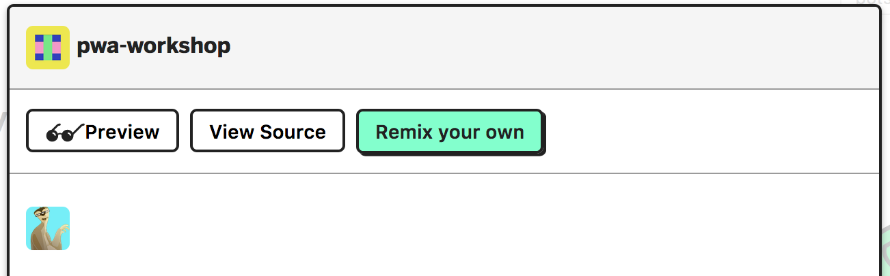

## Glitch {#glitch}

[Glitch](https://glitch.com) es una comunidad en la que crear desarrollos web de cualquier índole pues ofrece una infraestructura de servidor basada en Node.js, totalmente personalizable.

Glitch proporciona un editor de código _online_ y nombre de dominio, alojamiento y despliegue gratuítos. El editor de código es colaborativo y permite que varias personas modifiquen un proyecto al mismo tiempo.

El aspecto más interesante de Glitch es la _remezcla_ de proyectos que permite modificar un proyecto ajeno creando primero una copia personal.

El taller es, de hecho, un proyecto Glitch que los asistentes habrán de remezclar.

## Remezclar un proyecto {#remix}

Para remezclar el taller, visita el [enlace del proyecto pwa-workshop](https://glitch.com/~pwa-workshop) y haz click en remix:

Glitch generará un **nuevo nombre** para el proyecto y abrirá el editor asociado al mismo. Recuerda que dos proyectos, aun con el mismo código pero con **nombres distintos**, son efectivamente dos aplicaciones distintas por lo que, aunque se comporten de igual forma, no compartirán el estado de memoria o disco.

Si no has iniciado sesión en Glitch, podrás modificar el proyecto pero no podrás preservar los cambios si cierras el navegador. Para salvar los cambios de una sesión a otra, inicia sesión con tus [credenciales de GitHub](https://github.com/login/oauth/authorize?client_id=b4cb743ed07e20abf0b2&scope=user:email&redirect_uri=https://glitch.com/login/github) o [Facebook](https://www.facebook.com/v2.9/dialog/oauth?client_id=660180164153542&scope=email&redirect_uri=https%3A%2F%2Fglitch.com%2Flogin%2Ffacebook).

Una vez inicies sesión, podrás gestionar el proyecto a través del menú del proyecto:

Puedes cambiar el nombre editándolo directamente mientras el menú esté desplegado.

## Visualizar el proyecto {#show}

Puedes lanzar el proyecto, haciendo click en el botón _show_:

Glitch abrirá una nueva ventana y se encargará de refrescarla tras cualquier modificación en el cliente o servidor.

## Editar el proyecto {#edit}

Puedes editar cualquiera de los ficheros situados a la izquierda del editor:

El fichero `server.js` es el punto de entrada al servidor. Cualquier modificación en este fichero relanzará la aplicación.

También puedes crear nuevos archivos con el botón _new file_. El fichero debe incluir la ruta completa en la que será emplazado. Si la ruta no existiera, se crearían las carpetas intermedias automáticamente.

No encontrarás un botón de salvar porque Glitch intentará guardar cada alteración tan pronto como se produzca.

Puedes depurar fácilmente el servidor utilizando _logs_. Para visualizarlos, haz click en el botón _logs_.

El fichero `.env`, precedido por el icono de la llave es un fichero especial con variables de entorno y privado. Sólo el dueño del proyecto puede visualizarlo.

### Compartir el código del proyecto {#share}

Para compartir el código, haz click en el botón _share_ y utiliza el primer enlace para compartir tu código en modo sólo lectura o el segundo para comenzar una sesión colaborativa.

El contenido del fichero `.env` no podrá ser visualizado por los invitados en modo lectura.

## Subir nuevos recursos {#assets}

Con Glitch sólo puedes crear nuevos archivos de texto. Los ficheros binarios como imágenes, vídeos, sonidos... se gestionan a través del menú _assets_.

Para visualizar los recursos de tu proyecto, haz click en el elemento _assets_ del listado de ficheros.

Puedes acceder a los detalles del recurso haciendo click sobre el mismo. Allí puedes encontrar la URL del recurso y copiarla pulsando sobre _Copy Url_.

Puedes añadir un nuevo recurso haciendo click en el botón _Add asset_:

